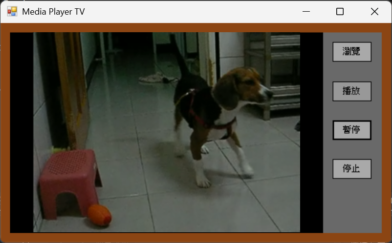
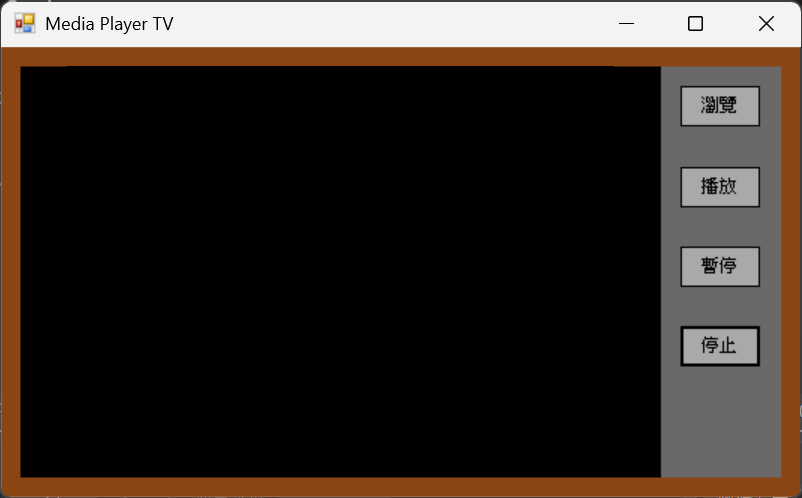

## 多媒體播放器
使用 Windows Media Player 元件播放影片或其他多媒體檔案，教材示範可開啟 `.wmv`、`.mp4`、`.avi` 等格式，並以外部按鈕控制播放、暫停與停止。

### 復古電視機造型

**功能：**
- 瀏覽多媒體檔案。
- 播放影片或音訊。
- 暫停播放。
- 停止播放。(會直接黑幕)
- 

**使用技術：**
- Windows Forms
- Windows Media Player 控制項
- `Ctlcontrols.play()`
- `Ctlcontrols.pause()`
- `Ctlcontrols.stop()`

## 開發環境

- Visual Studio
- C# Windows Forms App
- .NET Framework / Windows Forms 專案類型
- Windows 作業系統
